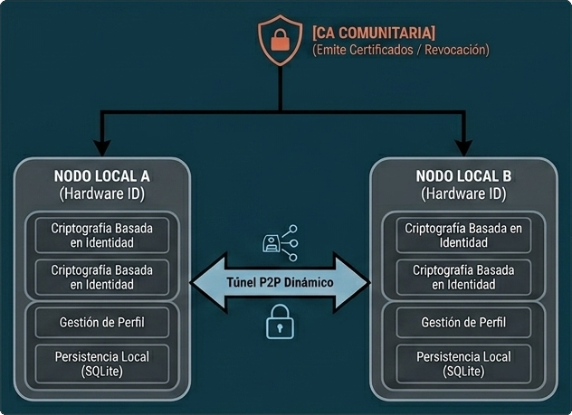
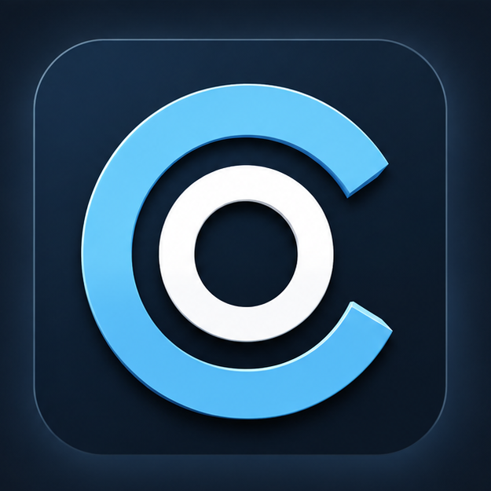
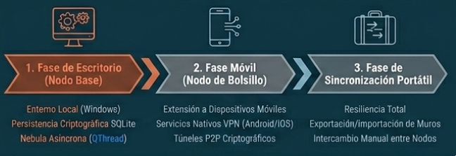

# Com Org — Red Social Mesh & Soberanía Individual

> **Comunidad Organizada:** Un nuevo paradigma de interacción humana libre de manipulación algorítmica, construido sobre
> redes superpuestas descentralizadas (_Mesh Overlay Networks_). Una respuesta soberana de Tercera Posición frente al
> colonialismo digital.

---

## 🧭 1. Infraestructura es Destino

Las redes sociales modernas confunden conectividad con comunidad. Al depender de infraestructuras centralizadas y nubes
corporativas administradas por las potencias del Norte global, el usuario no es dueño de su contenido; es el combustible
de un sistema diseñado para secuestrar su atención mediante mecánicas de dopamina artificial (_likes_, algoritmos de
indignación, feeds infinitos y métricas de vanidad).

**Com Org** hackea esta realidad transformando los principios éticos en leyes físicas de la infraestructura local.
Recuperamos el concepto histórico de la **Comunidad Organizada** como alternativa al individualismo liberal de las Big
Tech y al control estatal centralizado: la comunidad que se auto-gobierna, se auto-sustenta y se defiende desde sus
propias bases tecnológicas locales.

- **Soberanía Absoluta del Dato:** Tu contenido reside única y exclusivamente en tu dispositivo físico. Si decides
  borrar una publicación, esta deja de existir en la red activa de forma inmediata. No hay nube, no hay servidores
  centrales, no hay bases de datos corporativas en propiedad de terceros.
- **Diseño Sin Dopamina:** Se eliminan por completo las dinámicas de validación superficial. La conversación madura,
  articulada y constructiva es el único eje. Para interactuar con una idea, no basta con presionar un botón; se debe
  formular un argumento real utilizando el canal único: **`↩ Responder`**.
- **Filtro Antispam por Costo Físico:** Al no existir un servidor central que subsidie el almacenamiento de _bots_, la
  huella digital de procesamiento y almacenamiento en disco tiene un costo real y directo para el emisor (CPU y
  almacenamiento local). El spam automatizado masivo se vuelve económicamente inviable.

---

## 🛠️ 2. Arquitectura Lógica: Criptografía Basada en Identidad

A diferencia de los enfoques Peer-to-Peer (P2P) tradicionales que sufren de caos organizativo o ataques de suplantación
(_Sybil Attacks_), **Com Org** propone una red de mallas privadas basada en certificados criptográficos vinculados
directamente al hardware del dispositivo.

### Control de Acceso por CA Privada

Para ingresar a la red, cada nodo requiere un certificado firmado por la Autoridad de Certificación (CA) de la
comunidad. No existen contraseñas, nombres de usuario centrales ni correos electrónicos obligatorios; tu identidad es
una llave criptográfica.

- **Garantía de Convivencia:** Si un actor incurre en dinámicas destructivas (spam masivo, violencia explícita), la
  comunidad no borra sus posts (lo cual violaría la soberanía de su almacenamiento local), sino que la CA revoca su
  certificado. En el próximo intercambio de red, el nodo indeseable queda aislado en el vacío, incapaz de enrutar,
  propagar o recibir datos.

### Moderación Soberana por ADN Local

Cada publicación genera un hash único SHA-256 (el **ADN del Post**), firmado digitalmente por las claves criptográficas
Ed25519 del emisor, asociadas al identificador físico de su máquina (`MachineGuid` / `ANDROID_ID`). Los usuarios aplican
filtros locales basados en estos hashes sin depender de un comité de censura centralizado. Tu computadora decide qué
procesa y qué ignora de forma soberana.

---

## 🛰️ 3. Cimientos Tecnológicos y Créditos

Este proyecto no intenta reinventar la rueda a nivel de transporte de red, sino desviar una tecnología de
infraestructura crítica de nivel corporativo y militar hacia un fin puramente humano, civil y social.

El núcleo de la malla de comunicación descentralizada de **Com Org** está conceptualizado sobre **Nebula**, el motor de
redes superpuestas (_Overlay Networks_) de código abierto desarrollado originalmente por **Slack Technologies**.

### ¿Por qué Nebula?

Agradecemos y reconocemos el extraordinario trabajo de ingeniería del equipo de Nebula, cuya arquitectura nos permite
heredar directamente:

- **Descubrimiento Distribuido:** Los nodos se encuentran y coordinan a través de Faros (_Lighthouses_) que solo
  facilitan el intercambio de direcciones IPs públicas para establecer la conexión, pero **jamás transportan, almacenan,
  ni ven el contenido del tráfico**.
- **Túneles Dinámicos P2P (NAT Traversal):** Conexiones directas de igual a igual entre dispositivos (computadoras,
  servidores locales, teléfonos móviles) incluso si se encuentran detrás de firewalls domésticos estrictos o NATs
  simétricas.
- **Firewall Interno Basado en Identidad:** El tráfico se valida única y estrictamente por _quién eres_ (tu certificado
  criptográfico firmado por la CA) y no por dónde estás (tu dirección IP). Firewall Interno Basado en Identidad: El
  tráfico se valida única y estrictamente por quién eres (tu certificado criptográfico firmado por la CA) y no por dónde
  estás (tu dirección IP).

- **Nota sobre el desarrollo:** Si bien Com-Org se apoya en el motor de transporte de Nebula para la conectividad de
  red, la capa lógica que define la arquitectura de faros, la gestión de la CA principal y las reglas de soberanía del
  usuario son desarrollos propietarios. La integridad de este sistema es fundamental para garantizar la seguridad civil
  del proyecto, por lo que su modificación o alteración fuera de los canales oficiales está estrictamente prohibida,
  manteniendo el código bajo un modelo de auditoría pública y desarrollo centralizado."

---

## 🇦🇷 4. Soberanía, Escarapela y Tercera Posición

La identidad visual y el nombre de **Com Org** no son elecciones casuales; representan una postura geopolítica y
filosófica frente al software y la organización humana.

  

### La Filosofía de la "Comunidad Organizada"

El proyecto adopta su nombre como una referencia directa a la propuesta filosófico-política fundacional del pensamiento
soberano argentino. Ante la falsa dicotomía del mundo moderno, **Com Org** se planta como una **Tercera Posición
Tecnológica**:

- **Frente al Individualismo Liberal (Silicon Valley):** En lugar de concebir a los usuarios como átomos aislados que
  compiten por métricas de vanidad, dopamina e influencia algorítmica, prioriza el lazo comunitario real.
- **Frente al Colectivismo Centralista:** Rechaza la sumisión ante servidores gubernamentales o corporativos que
  vigilan, censuran y expropian la información de los ciudadanos.

Aquí, el software es la herramienta que permite a la comunidad organizarse desde abajo, de igual a igual (P2P), donde el
todo armoniza con las partes sin anular la libertad del individuo.

### Los Colores de la Emancipación Popular

El emblema entrelaza las iniciales de la comunidad (`C` y `O`) utilizando los colores de la **Bandera Nacional y la
Escarapela Argentina**, insignia de la revolución y de la independencia popular de mayo de 1810. La tecnología en la
periferia no debe ser un vector de colonización cultural ni económica; debe ser el lenguaje con el que los pueblos
defienden su propia soberanía local sobre el dato y el territorio digital.

---

## 🎨 5. Interfaz Gráfica Premium (Human-Centric UI)

El entorno visual de **Com Org** rechaza la estética genérica de las plataformas web actuales, optando por una interfaz
asíncrona de alta densidad informativa y rendimiento nativo.

| Parámetro                    | Configuración Estética                                                                                                                           |
| :--------------------------- | :----------------------------------------------------------------------------------------------------------------------------------------------- |
| **Paleta Modo Oscuro**       | Fondo Petróleo Profundo (`#0F1419`), Tarjetas (`#13202C`), Borde Técnico (`#2E455C`), Acento Terracota (`#C97A2B`).                              |
| **Paleta Modo Claro**        | Base Documento Técnico (`#EEF1F5`) con paneles de contraste acero oscuro para una legibilidad prolongada impecable.                              |
| **Arquitectura de Interfaz** | Estructura asíncrona en 3 columnas (Identidad y Límites / Pizarra de Muro y Exploración / Tendencias Locales).                                   |
| **Tratamiento de Medios**    | Procesamiento local con recorte inteligente de avatares a 256×256px y renderizado premium de imágenes adjuntas escaladas de forma suave a 480px. |

---

## 🗺️ 6. Hoja de Ruta Conceptual (Pipeline de Desarrollo)

1.  **Fase de Escritorio (Nodo Base):** Consolidación del entorno operativo local con persistencia criptográfica en
    disco (SQLite), aislamiento de hilos asíncronos para la UI y orquestación nativa del túnel de red.
2.  **Fase Móvil (Nodo de Bolsillo):** Extensión de la red hacia dispositivos móviles mediante el uso y aprovechamiento
    de los servicios de VPN nativos del sistema operativo, transportando la malla criptográfica en el bolsillo sin
    requerir privilegios de administrador (_root_).
3.  **Fase de Sincronización Portátil:** Diseño de mecanismos de exportación e importación manual de muros lógicos e
    historiales para garantizar la resiliencia absoluta de la información, incluso en escenarios de aislamiento estricto
    o apagones de infraestructura de Internet.

---

